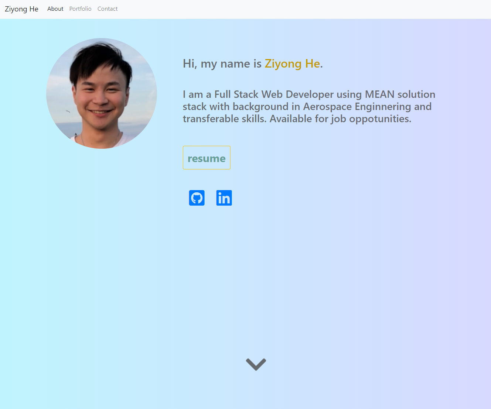

# Portfolio

This portfolio introduces myself, containing my resume, social media links, applied projects that I have done. This web application is mobile-first responsive design.

:link: [Portfolio Website](https://ziyonghe.github.io/Portfolio/index.html)

## Built with

- [Bootstrap 4.5](https://getbootstrap.com/)
- [Font Awesome 4.7](https://fontawesome.com/v4.7.0/)
- [Animate On Scroll](https://michalsnik.github.io/aos/)
- [anime.js 3.2](https://animejs.com/)

